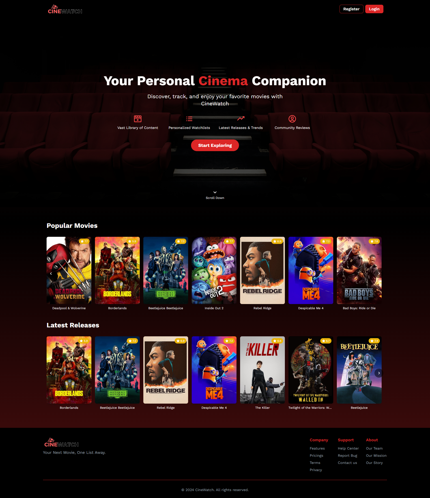

<div align="center">
  


  🎬 Your Personal Movie and TV Show Watchlist Manager 🍿

     

  [Features](#features) • [Demo](#demo) • [Installation](#installation) • [Usage](#usage) • [API](#api) • [Contributing](#contributing) • [License](#license)

</div>

## Features

- 👤 User account creation and authentication
- 🎭 Personalized dashboard with user info and favorite content
- 🔍 Browse and filter movies and TV shows
- ➕ Add content to personal watchlist
- 💾 Data persistence using localStorage

## Demo



## Installation

1. Clone the repository:
   ```sh
   git clone https://github.com/khalilelamraoui/cinewatch.git
   ```
2. Navigate to the project directory:
   ```sh
   cd cinewatch
   ```
3. Install dependencies:
   ```sh
   npm install
   ```

## Usage

1. Start the development server:
   ```sh
   npm start
   ```
2. Open your browser and visit `http://localhost:3000`

## API
CineWatch uses The Movie Database (TMDB) API to fetch movie and TV show data.

### Key Endpoints

1. **Popular Movies**
   - Function: `getPopularMovies(page, sortBy)`
   - Fetches a list of popular movies
   - Parameters: page (for pagination), sortBy (e.g., 'popularity.desc')

2. **Search Movies**
   - Function: `searchMovies(query, page)`
   - Searches for movies based on a query string
   - Parameters: query (search term), page (for pagination)

3. **Movies by Genre**
   - Function: `getMoviesByGenre(genreId, page, sortBy)`
   - Fetches movies filtered by a specific genre
   - Parameters: genreId, page, sortBy

4. **Get Genres**
   - Function: `getGenres()`
   - Fetches a list of all available movie genres

### Usage

- The API is used to populate the main browse page with movies.
- It supports searching, filtering by genre, and sorting.
- Pagination is implemented for browsing through large sets of results.
- Genre list is fetched once and used to populate the genre filter dropdown.

### Error Handling

- API calls include error handling to manage failed requests gracefully.
- Errors are logged to the console for debugging purposes.


## Contributing

We welcome feedback and suggestions! Please open an issue or submit a pull request.

## License

This project is licensed under the [Your License] License - see the [LICENSE](LICENSE) file for details.

---

<div align="center">
  Made with ❤️ by Leknouch Wissal - El Amraoui Khalil

  Leknouch Wissal: [GitHub](https://github.com/Clear008) • [LinkedIn](https://www.linkedin.com/in/wissal-leknouch-420181313/)
  El Amraoui Khalil: [GitHub](https://github.com/khalilelamraoui) • [LinkedIn](https://www.linkedin.com/in/khalil-el-amraoui-5834a9216/)
</div>